---
## Front matter
lang: ru-RU
title: Лабораторная работа №1
subtitle: Операционные системы
author:
  - Карпова А. А.
institute:
  - Российский университет дружбы народов, Москва, Россия
  - Объединённый институт ядерных исследований, Дубна, Россия
date: 02 марта 2024

## i18n babel
babel-lang: russian
babel-otherlangs: english

## Formatting pdf
toc: false
toc-title: Содержание
slide_level: 2
aspectratio: 169
section-titles: true
theme: metropolis
header-includes:
 - \metroset{progressbar=frametitle,sectionpage=progressbar,numbering=fraction}
 - '\makeatletter'
 - '\beamer@ignorenonframefalse'
 - '\makeatother'
 
## Fonts
mainfont: PT Serif
romanfont: PT Serif
sansfont: PT Sans
monofont: PT Mono
mainfontoptions: Ligatures=TeX
romanfontoptions: Ligatures=TeX
sansfontoptions: Ligatures=TeX,Scale=MatchLowercase
monofontoptions: Scale=MatchLowercase,Scale=0.9

---

## Цель работы

Целью данной работы является приобретение практических навыков установки операционной системы на виртуальную машину, настройки минимально необходимых для дальнейшей работы сервисов.

## Задание

1. Установка ВМ
2. Установка ОС в ВМ
3. Установка драйверов
4. Настройка раскладки клавиатуры
5. Установка имени пользователя и хоста
6. Подключение общей папки
7. Установка pandoc и texlive
8. Домашнее задание и ответы на контрольные вопросы

## Выполнение лабораторной работы. Установка ВМ

Cоздаю виртуальную машину (рис. 1).

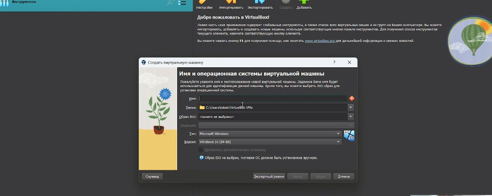{#fig:001 width=70%}

## Выполнение лабораторной работы. Установка ВМ

Далее устанавливаю необходимый мне объём памяти. В моём случае - 5131мб (рис. 2).

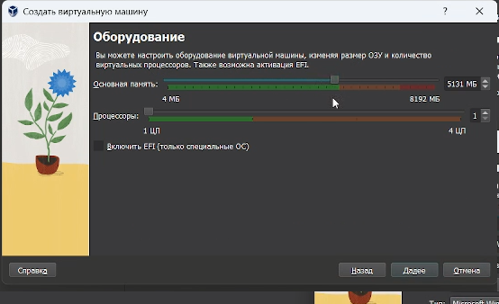{#fig:002 width=70%}

## Выполнение лабораторной работы. Установка ВМ

Устанавливаю размер жёсткого диска - 80гб (рис. 3).

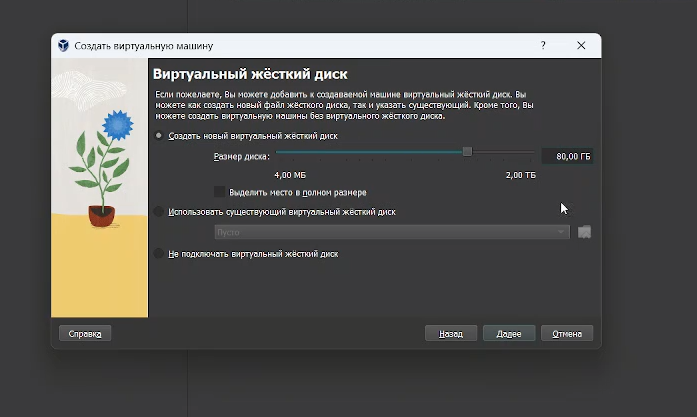{#fig:003 width=70%}

## Выполнение лабораторной работы. Установка ВМ

Всё установила, теперь перехожу в настройки ВМ и захожу в категорию Дисплей, ставлю видеопамять на 128мб и включаю 3-D ускорение. (рис. 4).

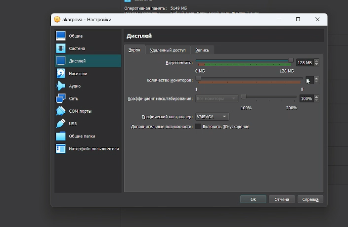{#fig:004 width=70%}

## Выполнение лабораторной работы. Установка ВМ

Запускаю ВМ и передо мной высвечивается такое окно. Выбираю первое используя стрелочку вверх и Enter. (рис. 5).

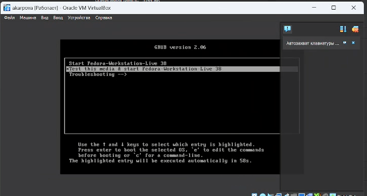{#fig:005 width=70%}

## Выполнение лабораторной работы. Установка ВМ

После запуска откроется окошко с предложением установить Fedora, я нажимаю на кнопку установки, жду некоторое время и появляется окно с настройкой Федоры (рис. 6).

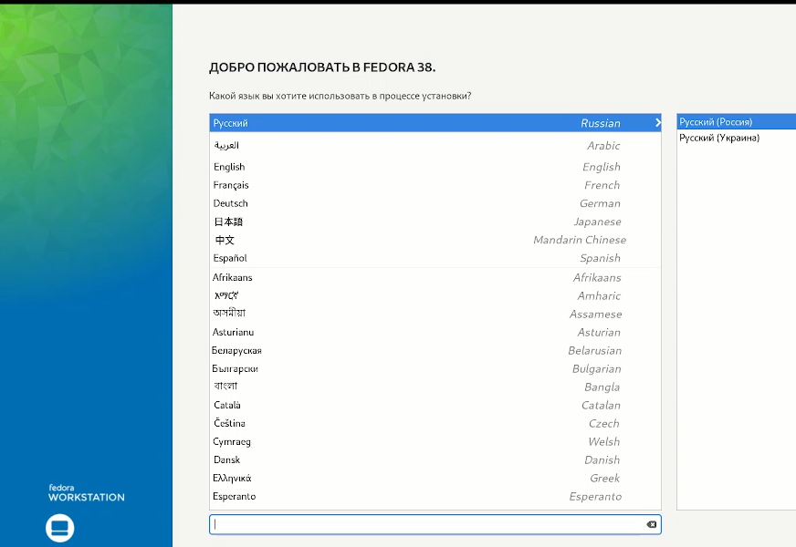{#fig:006 width=70%}

## Выполнение лабораторной работы. Установка ВМ

Настроила всё, что необходимо и жду когда установится (рис. 7).

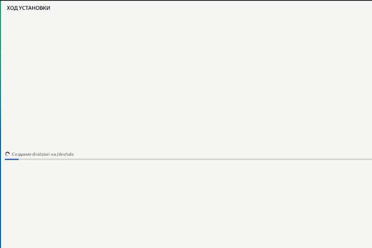{#fig:007 width=70%}

## Выполнение лабораторной работы. Установка ВМ

После установки перезагружаю ВМ. После перезапузка снова появится окно, но уже с настройкой пользователя Fеdora (рис. 8).

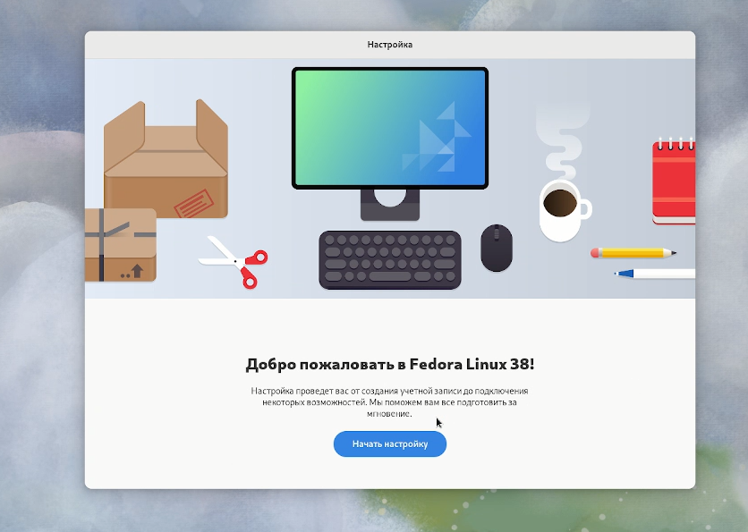{#fig:008 width=70%}

## Выполнение лабораторной работы. Установка ВМ

Устанавливаю имя пользователя (рис. 9).

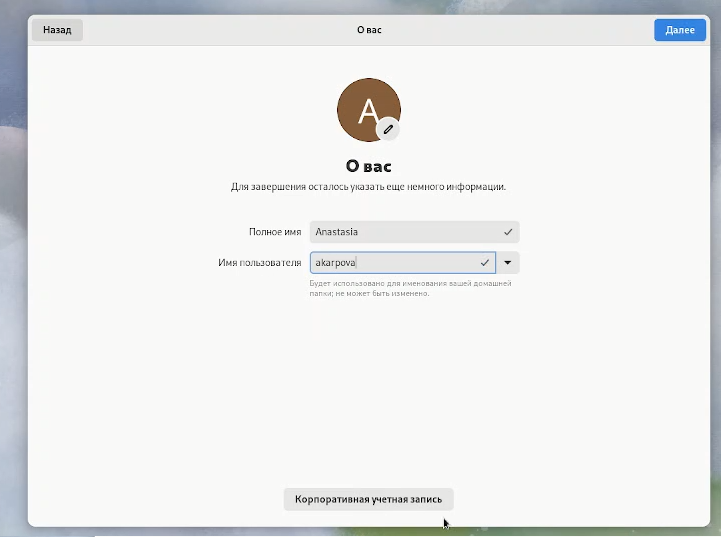{#fig:009 width=70%}

## Выполнение лабораторной работы. Установка ВМ

Устанавливаю пароль (рис. 10).

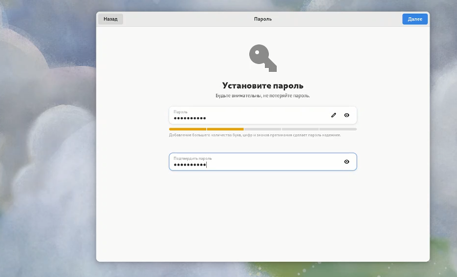{#fig:010 width=70%}

## Выполнение лабораторной работы. Установка ОС в ВМ

Перехожу в root с помощь команды sido -i и обновляю все пакеты. (рис. 11).

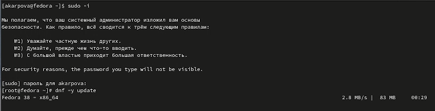{#fig:011 width=70%}

## Выполнение лабораторной работы. Установка ОС в ВМ

Устанавливаю программы для удобства в работе (рис. 12).

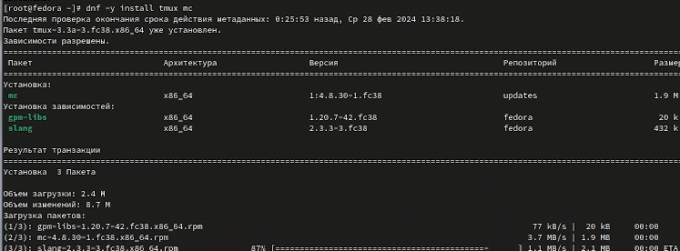{#fig:012 width=70%}

## Выполнение лабораторной работы. Установка ОС в ВМ

Устанавливаю ПО (рис. 13).

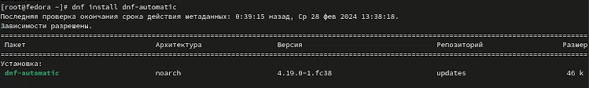{#fig:013 width=70%}

## Выполнение лабораторной работы. Установка ОС в ВМ

Запускаю таймер (рис. 14).

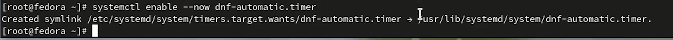{#fig:014 width=70%}

## Выполнение лабораторной работы. Установка ОС в ВМ

В файле /etc/selinux/config замените значение SELINUX=enforcing на SELINUX=permissive и перезагружаю ВМ (рис. 15).

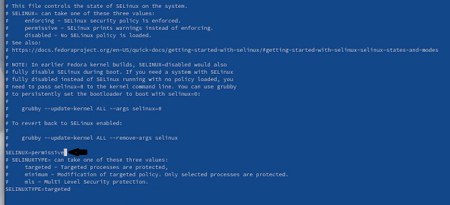{#fig:015 width=70%}

## Выполнение лабораторной работы. Установка драйверов

Снова перехожу в root и устанавливаю средства разработки (рис. 16).

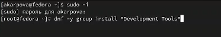{#fig:016 width=70%}

## Выполнение лабораторной работы. Установка драйверов

Далее устанавливаю пакет DKMS (рис. 17).

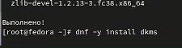{#fig:017 width=70%}

## Выполнение лабораторной работы. Установка драйверов

В меню виртуальной машины подключаю образ диска дополнений гостевой ОС (рис. 18).

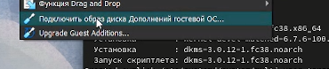{#fig:018 width=70%}

## Выполнение лабораторной работы. Установка драйверов

Монтирую диск и устанавливаю драйвера, перезагружаю ВМ (рис. 19).

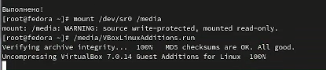{#fig:019 width=70%}

## Выполнение лабораторной работы. Настройка раскладки клавиатуры

Запускаю терминальный мультиплексор. Переключаюсь на супер-пользователя, перехожу в etc/X11/xorg.conf.d/00-keyboard.conf и редактирую файл. Снова перезапускаю ВМ (рис. 20).

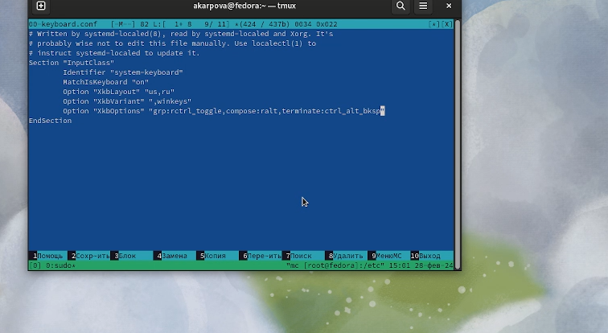{#fig:020 width=70%}

## Выполнение лабораторной работы. Установка имени пользователя и названия хоста

Запускаю терминальный мультиплексор. Переключаюсь на супер-пользователя. Создаю пользователя и пароль для него(как оказалось всё уже существует). Поэтому дальше устанавливаю имя хоста (рис. 21) (рис. 22). 

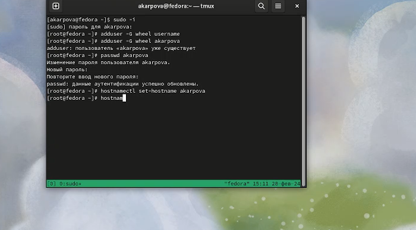{#fig:021 width=70%} 

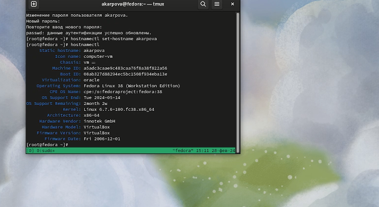{#fig:022 width=70%}

## Выполнение лабораторной работы. Подключение общей папки

Внутри виртуальной машины добавляю своего пользователя в группу vboxsf. В хостовой системе подключаю разделяемую папку, перезапускаю ВМ (рис. 23).

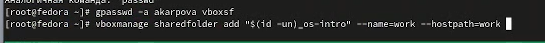{#fig:023 width=70%}

## Выполнение лабораторной работы. Установка pandoc и texlive

Устанваливаю pandoc и его составляющие (рис. 24).

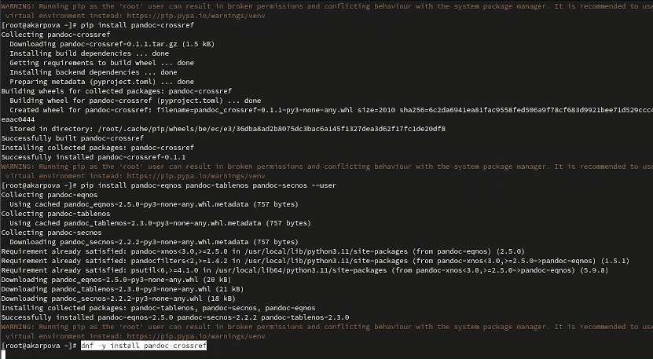{#fig:024 width=70%}

## Выполнение лабораторной работы. Установка pandoc и texlive

Далее устанавливаю texlive (рис. 25).

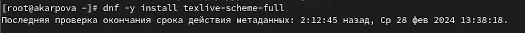{#fig:025 width=70%}

## Выполнение лабораторной работы. Домашнее задание и ответы на контрольные вопросы

Необходимо получить след. информацию:
    1.Версия ядра Linux (Linux version).
    2.Частота процессора (Detected Mhz processor).
    3.Модель процессора (CPU0).
    4.Объём доступной оперативной памяти (Memory available).
    5.Тип обнаруженного гипервизора (Hypervisor detected).
    6.Тип файловой системы корневого раздела.
    7.Последовательность монтирования файловых систем.
    
Использую dmesg | grep -i "то, что ищем".

Версия ядра равняется - см. фото (рис. 26).

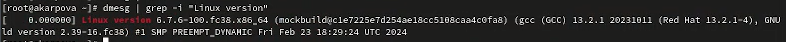{#fig:026 width=70%}

## Выполнение лабораторной работы. Домашнее задание и ответы на контрольные вопросы

Частота процессора - см. фото (рис. 27).

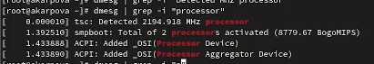{#fig:027 width=70%}

## Выполнение лабораторной работы. Домашнее задание и ответы на контрольные вопросы

Модель процессора - см фото (рис. 28).

{#fig:028 width=70%}

## Выполнение лабораторной работы. Домашнее задание и ответы на контрольные вопросы

Объем доступной ОП - см фото (рис. 29).

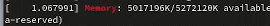{#fig:029 width=70%}

## Выполнение лабораторной работы. Домашнее задание и ответы на контрольные вопросы

Тип обнаруженного гипервизора - см. фото (рис. 30).

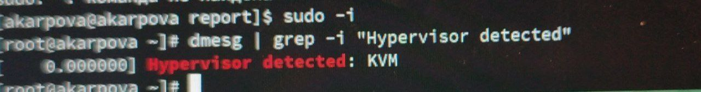{#fig:030 width=70%}

## Выполнение лабораторной работы. Домашнее задание и ответы на контрольные вопросы

Последовательность монтирования файловых систем - см фото (рис. 31).

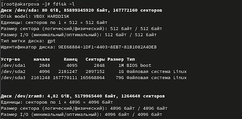{#fig:031 width=70%}

## Выполнение лабораторной работы. Домашнее задание и ответы на контрольные вопросы

Контрольные вопросы:

1. Какую информацию содержит учётная запись пользователя? - Учётная запись, как правило, содержит сведения, необходимые 
для опознания пользователя при подключении к системе, сведения для авторизации и учёта

## Выполнение лабораторной работы. Домашнее задание и ответы на контрольные вопросы

2. Команды терминала:
- для получения справки по команде? - man: например, man man выдаст руководство по данной команде
- для перемещения по файловой системе? - cd: cd work/study
- для просмотра содержимого каталога? - ls: ls work/stydy
- для определения объёма каталога? - du: du /work
- для создания / удаления каталогов / файлов? - mkdir: mkdir work / rmdir or rm -vr (если каталог не пустой): rmdir work / rm -vr work / rm work
- для задания определённых прав на файл / каталог? - chmod o-r month.txt
- для просмотра истории команд? - стрелочки вверх вниз или команда history

## Выполнение лабораторной работы. Домашнее задание и ответы на контрольные вопросы

3. Что такое файловая система? Приведите примеры с краткой характеристикой. - Файловая система - 
структура, используемая ОС для организации и управления файлами на устройстве хранения. 
Примеры: FAT - таблица распределения файлов, NTFS - файловая система новой технологии, ReFS - Resilient File System.
4. Как посмотреть, какие файловые системы подмонтированы в ОС? - Для этого есть команда findmnt
5. Как удалить зависший процесс? - Сочетание клавиш Ctrl + C

# Выводы

В ходе данной работы я приобрела практические навыкиустановки операционной системы на виртуальную машину, настройки минимально необходимых для дальнейшей работы сервисов.

# Список литературы{.unnumbered}

1. Dash, P. Getting Started with Oracle VM VirtualBox / P. Dash. – Packt Publishing Ltd, 2013. – 86 сс.
2. Colvin, H. VirtualBox: An Ultimate Guide Book on Virtualization with VirtualBox. VirtualBox / H. Colvin. – CreateSpace Independent Publishing Platform, 2015. – 70 сс.
3. Vugt, S. van. Red Hat RHCSA/RHCE 7 cert guide : Red Hat Enterprise Linux 7 (EX200 and EX300) : Certification Guide. Red Hat RHCSA/RHCE 7 cert guide / S. van Vugt. – Pearson IT Certification, 2016. – 1008 сс.
4. Робачевский, А. Операционная система UNIX / А. Робачевский, С. Немнюгин, О. Стесик. – 2-е изд. – Санкт-Петербург : БХВ-Петербург, 2010. – 656 сс.
5. Немет, Э. Unix и Linux: руководство системного администратора. Unix и Linux / Э. Немет, Г. Снайдер, Т.Р. Хейн, Б. Уэйли. – 4-е изд. – Вильямс, 2014. – 1312 сс.
6. Колисниченко, Д.Н. Самоучитель системного администратора Linux : Системный администратор / Д.Н. Колисниченко. – Санкт-Петербург : БХВ-Петербург, 2011. – 544 сс.
7. Robbins, A. Bash Pocket Reference / A. Robbins. – O’Reilly Media, 2016. – 156 сс.

::: {#refs}
:::
