---
## Front matter
title: "Отчёт по лабораторной работе №1"
subtitle: "Дисциплина:Операционные системы"
author: "Карпова Анастасия Александровна"

## Generic otions
lang: ru-RU
toc-title: "Содержание"

## Bibliography
bibliography: bib/cite.bib
csl: pandoc/csl/gost-r-7-0-5-2008-numeric.csl

## Pdf output format
toc: true # Table of contents
toc-depth: 2
lof: true # List of figures
fontsize: 12pt
linestretch: 1.5
papersize: a4
documentclass: scrreprt
## I18n polyglossia
polyglossia-lang:
  name: russian
  options:
	- spelling=modern
	- babelshorthands=true
polyglossia-otherlangs:
  name: english
## I18n babel
babel-lang: russian
babel-otherlangs: english
## Fonts
mainfont: PT Serif
romanfont: PT Serif
sansfont: PT Sans
monofont: PT Mono
mainfontoptions: Ligatures=TeX
romanfontoptions: Ligatures=TeX
sansfontoptions: Ligatures=TeX,Scale=MatchLowercase
monofontoptions: Scale=MatchLowercase,Scale=0.9
## Biblatex
biblatex: true
biblio-style: "gost-numeric"
biblatexoptions:
  - parentracker=true
  - backend=biber
  - hyperref=auto
  - language=auto
  - autolang=other*
  - citestyle=gost-numeric
## Pandoc-crossref LaTeX customization
figureTitle: "Рис."
tableTitle: "Таблица"
listingTitle: "Листинг"
lofTitle: "Список иллюстраций"
lolTitle: "Листинги"
## Misc options
indent: true
header-includes:
  - \usepackage{indentfirst}
  - \usepackage{float} # keep figures where there are in the text
  - \floatplacement{figure}{H} # keep figures where there are in the text
---

# Цель работы

Целью данной работы является приобретение практических навыков установки операционной системы на виртуальную машину, настройки минимально необходимых для дальнейшей работы сервисов.

# Задание

1. Установка ВМ
2. Установка ОС в ВМ
3. Установка драйверов
4. Настройка раскладки клавиатуры
5. Установка имени пользователя и хоста
6. Подключение общей папки
7. Установка pandoc и texlive
8. Домашнее задание и ответы на контрольные вопросы

# Выполнение лабораторной работы

## Установка ВМ

Cоздаю виртуальную машину (рис. [-@fig:001]).

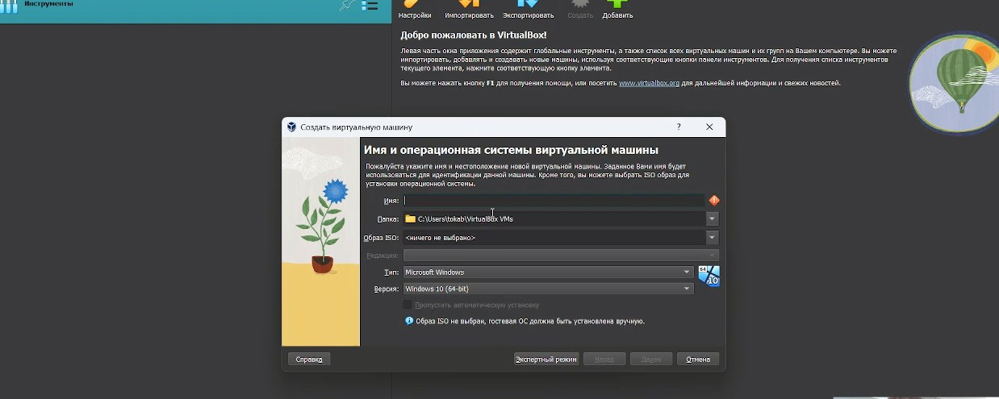{#fig:001 width=70%}

Далее устанавливаю необходимый мне объём памяти. В моём случае - 5131мб (рис. [-@fig:002]).

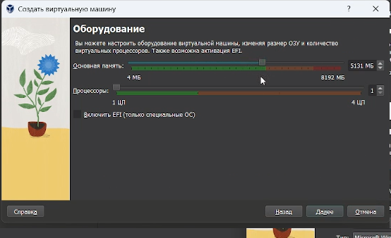{#fig:002 width=70%}

Устанавливаю размер жёсткого диска - 80гб (рис. [-@fig:003]).

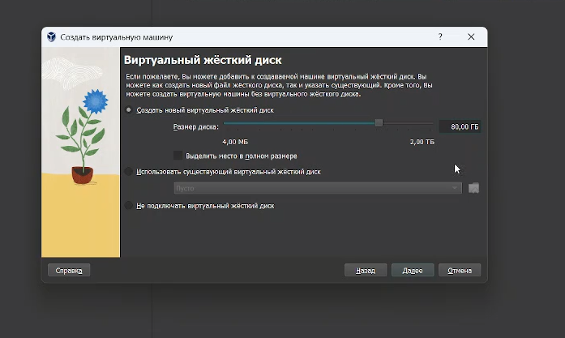{#fig:003 width=70%}

Всё установила, теперь перехожу в настройки ВМ и захожу в категорию Дисплей, ставлю видеопамять на 128мб и включаю 3-D ускорение. (рис. [-@fig:004]).

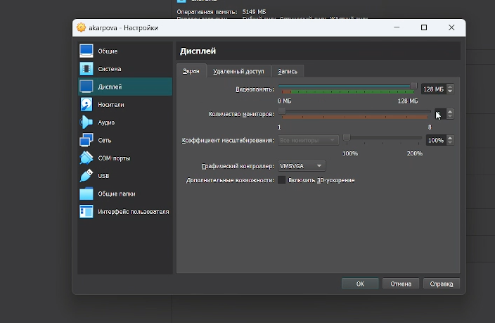{#fig:004 width=70%}

Запускаю ВМ и передо мной высвечивается такое окно. Выбираю первое используя стрелочку вверх и Enter. (рис. [-@fig:005]).

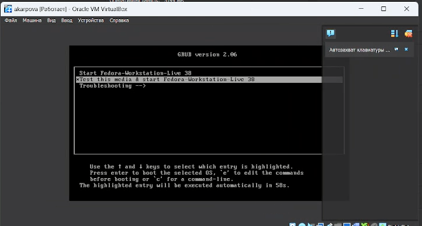{#fig:005 width=70%}

После запуска откроется окошко с предложением установить Fedora, я нажимаю на кнопку установки, жду некоторое время и появляется окно с настройкой Федоры (рис. [-@fig:006]).

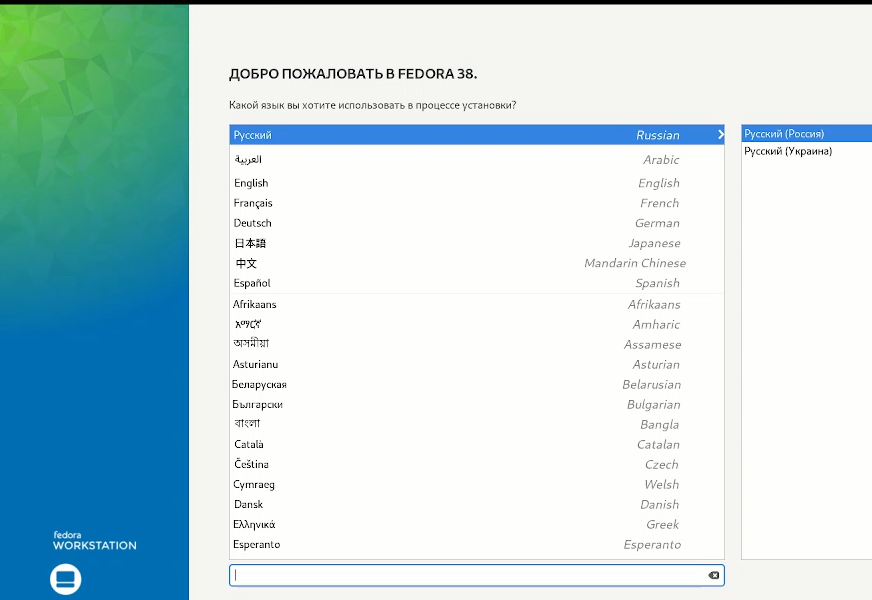{#fig:006 width=70%}

Настроила всё, что необходимо и жду когда установится (рис. [-@fig:007]).

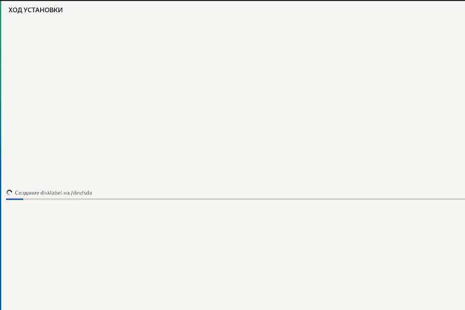{#fig:007 width=70%}

После установки перезагружаю ВМ. После перезапузка снова появится окно, но уже с настройкой пользователя Fеdora (рис. [-@fig:008]).

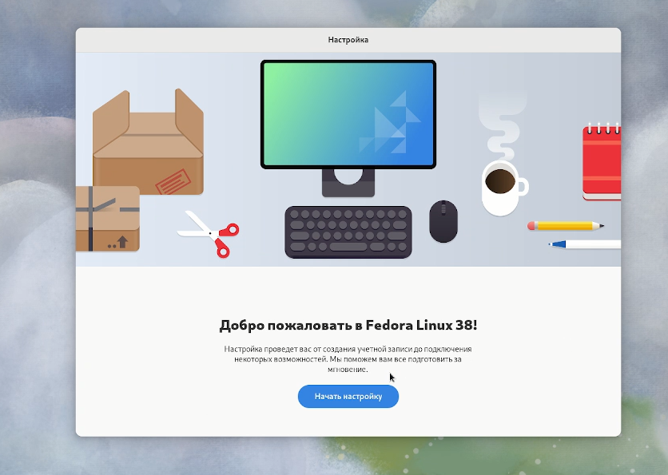{#fig:008 width=70%}

Устанавливаю имя пользователя (рис. [-@fig:009]).

{#fig:009 width=70%}

Устанавливаю пароль (рис. [-@fig:010]).

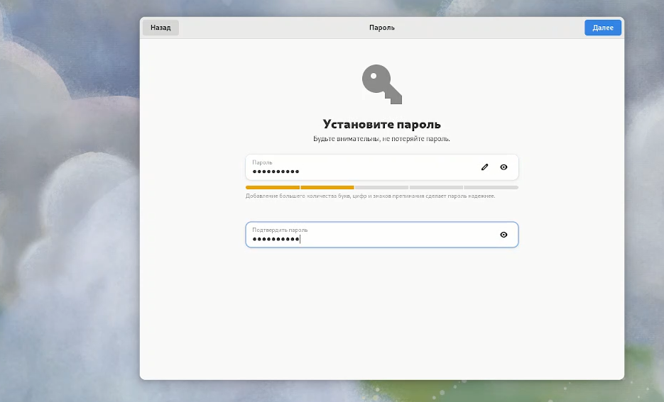{#fig:010 width=70%}

## Установка ОС в ВМ

Перехожу в root с помощь команды sido -i и обновляю все пакеты. (рис. [-@fig:011]).

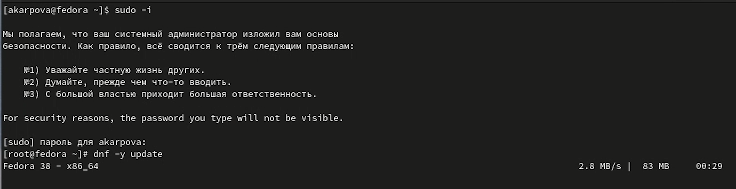{#fig:011 width=70%}

Устанавливаю программы для удобства в работе (рис. [-@fig:012]).

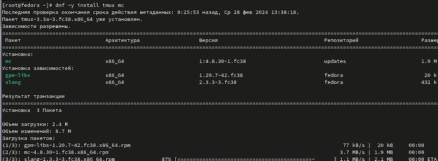{#fig:012 width=70%}

Устанавливаю ПО (рис. [-@fig:013]).

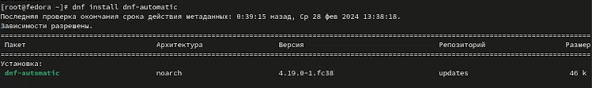{#fig:013 width=70%}

Запускаю таймер (рис. [-@fig:014]).

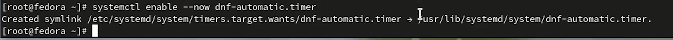{#fig:014 width=70%}

В файле /etc/selinux/config замените значение SELINUX=enforcing на SELINUX=permissive и перезагружаю ВМ (рис. [-@fig:015]).

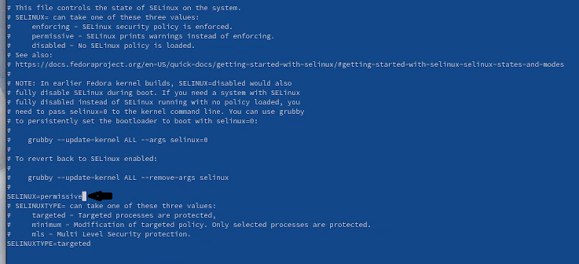{#fig:015 width=70%}

## Установка драйверов

Снова перехожу в root и устанавливаю средства разработки (рис. [-@fig:016]).

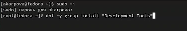{#fig:016 width=70%}

Далее устанавливаю пакет DKMS (рис. [-@fig:017]).

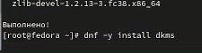{#fig:017 width=70%}

В меню виртуальной машины подключаю образ диска дополнений гостевой ОС (рис. [-@fig:018]).

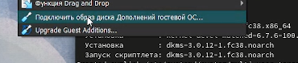{#fig:018 width=70%}

Монтирую диск и устанавливаю драйвера, перезагружаю ВМ (рис. [-@fig:019]).

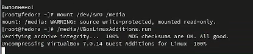{#fig:019 width=70%}

## Настройка раскладки клавиатуры

Запускаю терминальный мультиплексор. Переключаюсь на супер-пользователя, перехожу в etc/X11/xorg.conf.d/00-keyboard.conf и редактирую файл. Снова перезапускаю ВМ (рис. [-@fig:020]).

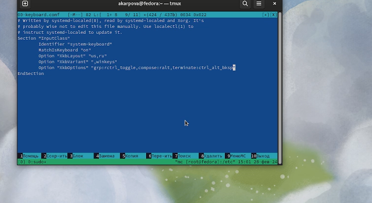{#fig:020 width=70%}

## Установка имени пользователя и названия хоста

Запускаю терминальный мультиплексор. Переключаюсь на супер-пользователя. Создаю пользователя и пароль для него(как оказалось всё уже существует). Поэтому дальше устанавливаю имя хоста (рис. [-@fig:021]) (рис. [-@fig:022]). 

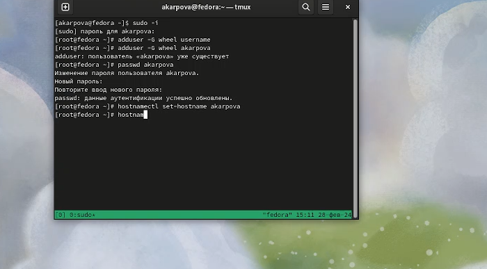{#fig:021 width=70%} 

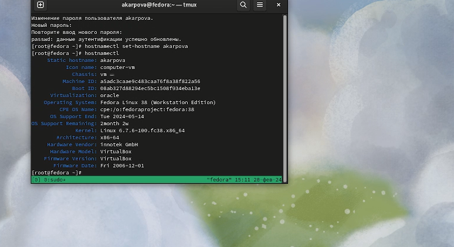{#fig:022 width=70%}

## Подключение общей папки

Внутри виртуальной машины добавляю своего пользователя в группу vboxsf. В хостовой системе подключаю разделяемую папку, перезапускаю ВМ (рис. [-@fig:023]).

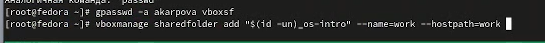{#fig:023 width=70%}

## Установка pandoc и texlive
	
Устанваливаю pandoc и его составляющие (рис. [-@fig:024]).

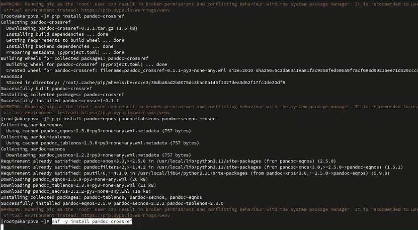{#fig:024 width=70%}

Далее устанавливаю texlive (рис. [-@fig:025]).

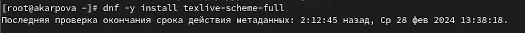{#fig:025 width=70%}

## Домашнее задание и ответы на контрольные вопросы

Необходимо получить след. информацию:
    1.Версия ядра Linux (Linux version).
    2.Частота процессора (Detected Mhz processor).
    3.Модель процессора (CPU0).
    4.Объём доступной оперативной памяти (Memory available).
    5.Тип обнаруженного гипервизора (Hypervisor detected).
    6.Тип файловой системы корневого раздела.
    7.Последовательность монтирования файловых систем.
    
Использую dmesg | grep -i "то, что ищем".

Версия ядра равняется - см. фото (рис. [-@fig:026]).

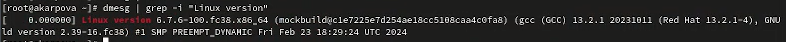{#fig:026 width=70%}

Частота процессора - см. фото (рис. [-@fig:027]).

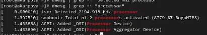{#fig:027 width=70%}

Модель процессора - см фото (рис. [-@fig:028]).

{#fig:028 width=70%}

Объем доступной ОП - см фото (рис. [-@fig:029]).

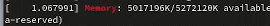{#fig:029 width=70%}

Тип обнаруженного гипервизора - см. фото (рис. [-@fig:030]).

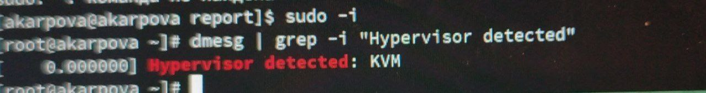{#fig:030 width=70%}

Последовательность монтирования файловых систем - см фото (рис. [-@fig:031]).

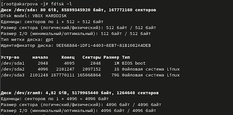{#fig:031 width=70%}

Контрольные вопросы:

1. Какую информацию содержит учётная запись пользователя? - Учётная запись, как правило, содержит сведения, необходимые для опознания пользователя при подключении к системе, сведения для авторизации и учёта

2. Команды терминала:
для получения справки по команде? - man: например, man man выдаст руководство по данной команде

для перемещения по файловой системе? - cd: cd work/study
для просмотра содержимого каталога? - ls: ls work/stydy
для определения объёма каталога? - du: du /work
для создания / удаления каталогов / файлов? - mkdir: mkdir work / rmdir or rm -vr (если каталог не пустой): rmdir work / rm -vr work / rm work
для задания определённых прав на файл / каталог? - chmod o-r month.txt
для просмотра истории команд? - стрелочки вверх вниз или команда history

3. Что такое файловая система? Приведите примеры с краткой характеристикой. - Файловая система - структура, используемая ОС для организации и управления файлами на устройстве хранения. Примеры: FAT - таблица распределения файлов, NTFS - файловая система новой технологии, ReFS - Resilient File System.

4. Как посмотреть, какие файловые системы подмонтированы в ОС? - Для этого есть команда findmnt

5. Как удалить зависший процесс? - Сочетание клавиш Ctrl + C

# Выводы

В ходе данной работы я приобрела практические навыкиустановки операционной системы на виртуальную машину, настройки минимально необходимых для дальнейшей работы сервисов.

# Список литературы{.unnumbered}

1. Dash, P. Getting Started with Oracle VM VirtualBox / P. Dash. – Packt Publishing Ltd, 2013. – 86 сс.
2. Colvin, H. VirtualBox: An Ultimate Guide Book on Virtualization with VirtualBox. VirtualBox / H. Colvin. – CreateSpace Independent Publishing Platform, 2015. – 70 сс.
3. Vugt, S. van. Red Hat RHCSA/RHCE 7 cert guide : Red Hat Enterprise Linux 7 (EX200 and EX300) : Certification Guide. Red Hat RHCSA/RHCE 7 cert guide / S. van Vugt. – Pearson IT Certification, 2016. – 1008 сс.
4. Робачевский, А. Операционная система UNIX / А. Робачевский, С. Немнюгин, О. Стесик. – 2-е изд. – Санкт-Петербург : БХВ-Петербург, 2010. – 656 сс.
5. Немет, Э. Unix и Linux: руководство системного администратора. Unix и Linux / Э. Немет, Г. Снайдер, Т.Р. Хейн, Б. Уэйли. – 4-е изд. – Вильямс, 2014. – 1312 сс.
6. Колисниченко, Д.Н. Самоучитель системного администратора Linux : Системный администратор / Д.Н. Колисниченко. – Санкт-Петербург : БХВ-Петербург, 2011. – 544 сс.
7. Robbins, A. Bash Pocket Reference / A. Robbins. – O’Reilly Media, 2016. – 156 сс.

::: {#refs}
:::
