---
## Front matter
lang: ru-RU
title: Структура научной презентации
subtitle: Простейший шаблон
author:
  - Кулябов Д. С.
institute:
  - Российский университет дружбы народов, Москва, Россия
  - Объединённый институт ядерных исследований, Дубна, Россия
date: 01 января 1970

## i18n babel
babel-lang: russian
babel-otherlangs: english

## Formatting pdf
toc: false
toc-title: Содержание
slide_level: 2
aspectratio: 169
section-titles: true
theme: metropolis
header-includes:
 - \metroset{progressbar=frametitle,sectionpage=progressbar,numbering=fraction}
 - '\makeatletter'
 - '\beamer@ignorenonframefalse'
 - '\makeatother'
 
## Fonts
mainfont: PT Serif
romanfont: PT Serif
sansfont: PT Sans
monofont: PT Mono
mainfontoptions: Ligatures=TeX
romanfontoptions: Ligatures=TeX
sansfontoptions: Ligatures=TeX,Scale=MatchLowercase
monofontoptions: Scale=MatchLowercase,Scale=0.9

---

## Цель работы

Выполнение первого этапа индвидуального проекта, начальное понимание hugo

## Задание

1. Установка Hugo

## Выполнение лабораторной работы

Скачиваю hugo c github (рис. 1).

{#fig:001 width=70%}

Перехожу в Downloads и распаковываю установленный зип-файл (рис. 2).

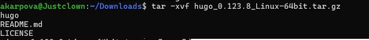{#fig:002 width=70%}

## Выполнение лабораторной работы

Создаю файл bin (рис. 3).

{#fig:003 width=70%}

Перенос файлов (рис. 4).

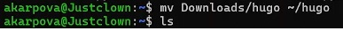{#fig:004 width=70%}

## Выполнение лабораторной работы

Перенос файлов (рис. 5).

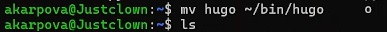{#fig:005 width=70%}

Проверка (рис. 6).

{#fig:006 width=70%}

## Выполнение лабораторной работы

Создаю новый репозиторий (рис. 7).

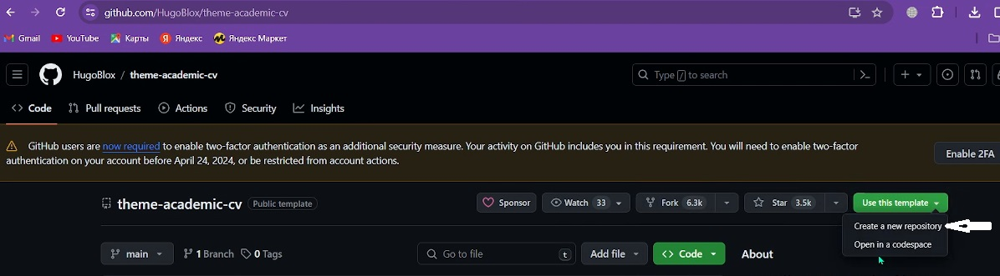{#fig:007 width=70%}

Задаю имя нового репозитория (рис. 8).

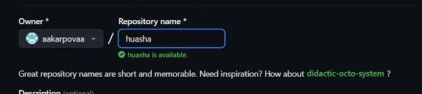{#fig:008 width=70%}

## Выполнение лабораторной работы

Копирую ссылку для клонирования (рис. 9).

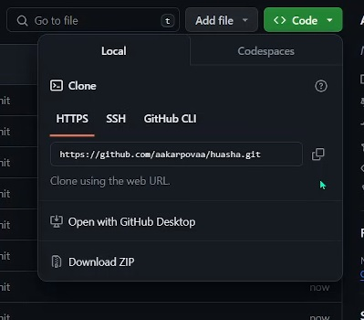{#fig:009 width=70%}

Клонирую репозиторий (рис. 10).

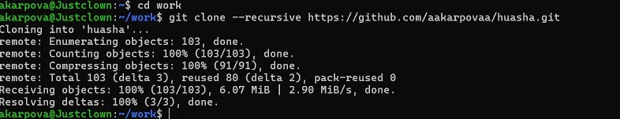{#fig:010 width=70%}

## Выполнение лабораторной работы

Далее использую след.команду. (рис. 11).

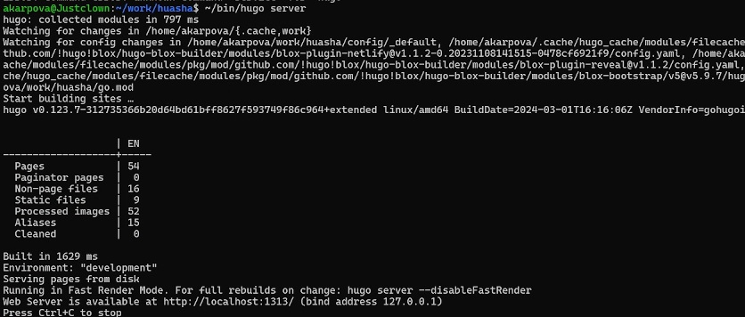{#fig:011 width=70%}

Создаю еще один новый репозиторий (рис. 12).

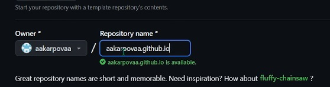{#fig:012 width=70%}

## Выполнение лабораторной работы

Копирую ссылку для клонирования (рис. 13).

{#fig:013 width=70%}

Клонирование репозитория + создание файла + пуш на гитхаб (рис. 14).

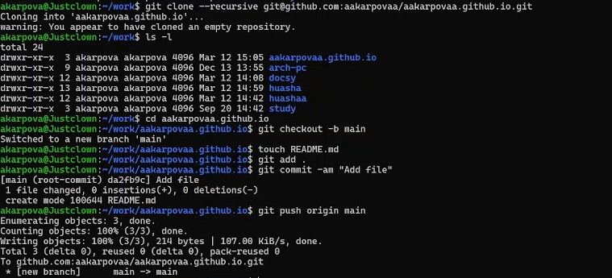{#fig:014 width=70%}

## Выполнение лабораторной работы

Клонирование (рис. 15).

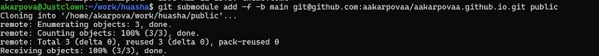{#fig:015 width=70%}

Проверка (рис. 16).

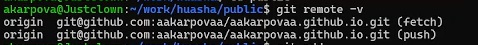{#fig:016 width=70%}

## Выполнение лабораторной работы

Запушиваю (рис. 17).

{#fig:017 width=70%}

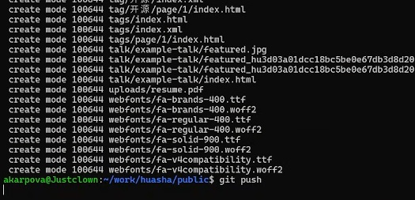{#fig:018 width=70%}

Проверяю (рис. 18)

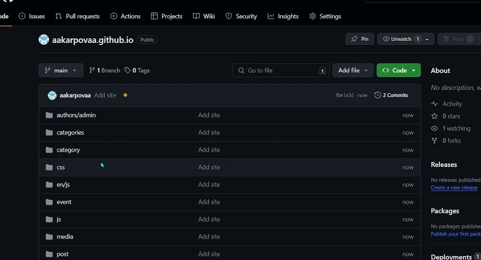{#fig:019 width=70%}

## Выводы

В ходе лаб.работы освоила начальную работу с hugo и файлами

## Список литературы{.unnumbered}

1. Архитектура ЭВМ

:::
